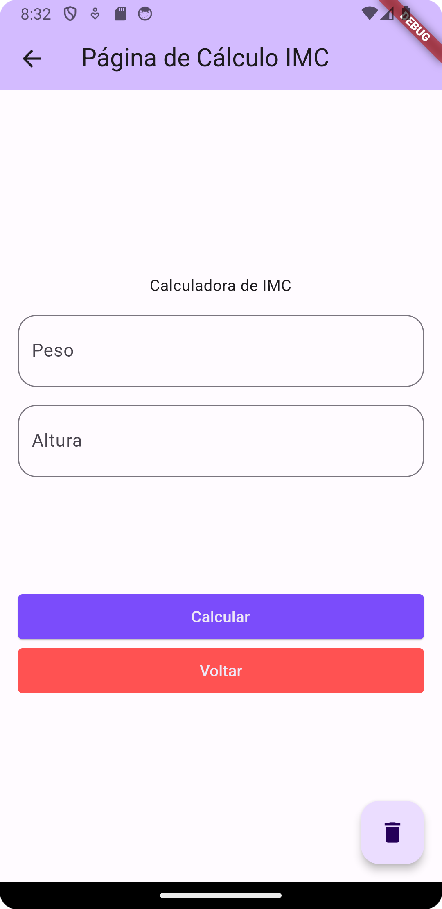
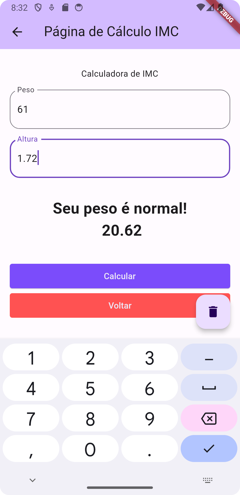
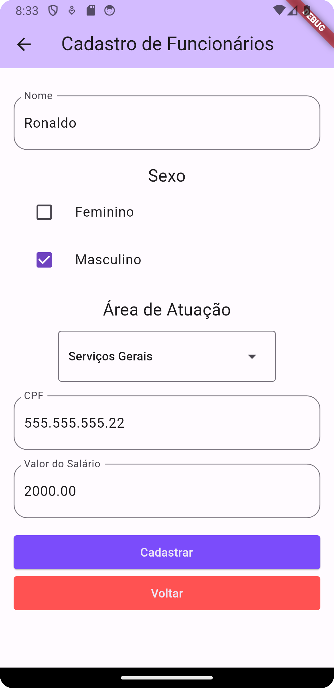

# Aplicativo UniSapiens de Desenvolvimento Mobile

Este repositório contém o código-fonte de um aplicativo móvel desenvolvido como parte de um projeto acadêmico na faculdade UniSapiens de Desenvolvimento Mobile. O aplicativo é construído usando o framework Flutter e tem como objetivo demonstrar habilidades de desenvolvimento Mobile.

## Funcionalidades Principais

1. **Tela Inicial:** A tela inicial do aplicativo exibe uma imagem e dois botões distintos para acessar diferentes funcionalidades.  

2. **Calculadora de IMC (Índice de Massa Corporal):** Um dos botões direciona o usuário para uma calculadora de IMC. Nesta tela, os usuários podem inserir seu peso e altura e, com base nesses dados, calcular seu IMC para avaliar sua saúde e condicionamento físico.

4. **Cadastro de Funcionário:** O segundo botão leva os usuários para uma página estática de cadastro de funcionários. Embora estática neste exemplo, esta funcionalidade pode ser estendida no futuro para permitir o cadastro e gerenciamento de informações de funcionários de forma dinâmica.

## Objetivo

O objetivo deste projeto é demonstrar o conhecimento incial em desenvolvimento mobile, especialmente o uso do framework Flutter, para criar interfaces de usuário funcionais, bem como a implementação de funcionalidades básicas, como cálculo de IMC e entrada de dados de funcionários.

## Recursos Técnicos

- **Flutter Framework:** O aplicativo é desenvolvido usando o Flutter, um framework de código aberto que facilita a criação de aplicativos nativos para Android e iOS a partir de um único código-base.

## Notas Adicionais

Este projeto faz parte do currículo acadêmico da faculdade UniSapiens de Desenvolvimento Mobile e serve como um exemplo inicial de desenvolvimento de aplicativos móveis. É uma base sólida para futuras melhorias e expansões de funcionalidades. Se você tiver alguma dúvida ou sugestão, sinta-se à vontade para abrir um problema neste repositório.
